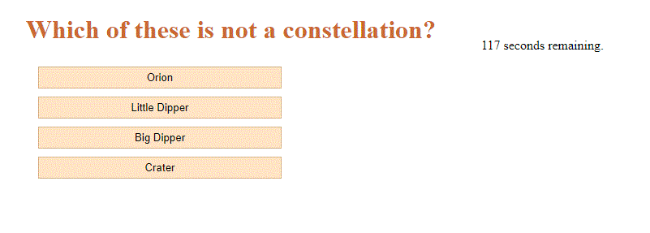

# Password Generator
Module 4 Challenge

## Description

The repository holds files to create a website that will give a multiple choice quiz 
  1) The user is presented with a number of questions for which the player chooses from four different possible answers.
  2) Player has a limited amount of time to answer all questions after which the player is not allowed to answer further questions.
  3) After the user answers all questions or time runs out, the player is presented with their score and asked to enter their initials.

## Installation

Contains\
  index.html\
  stylesheet style.css under directory assets/css\
  javascript script.js under directory assets/js\
  one image file under directory assets/images which is not used within the website\

## Screenshot

## Deployed at https://petemaynard.github.io/Quiz_Game/

## Repository at https://github.com/petemaynard/Password_Generator/Quiz_Game

## Credits

Created by Pete Maynard
with some assistance from tutor Dru Sanchez

